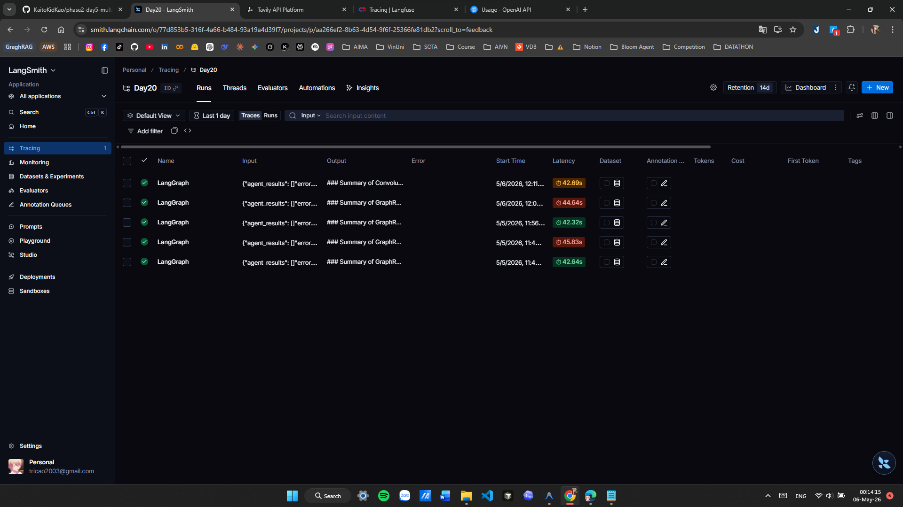
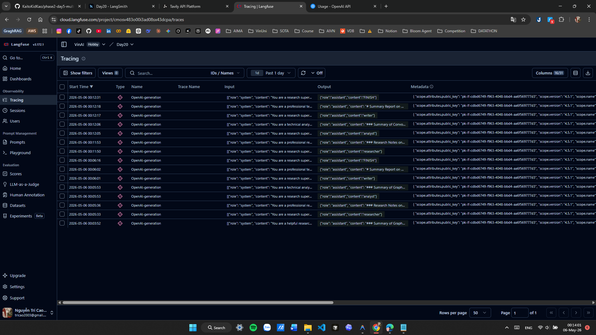
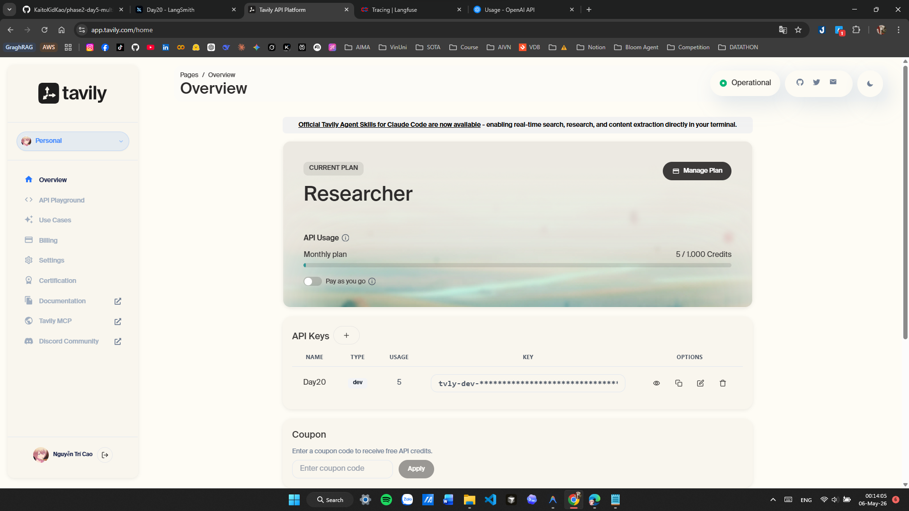

# Benchmark Report: Single-Agent vs Multi-Agent Research System

## 1. Overview
Báo cáo này so sánh hiệu suất và chất lượng giữa hệ thống Single-Agent (Baseline) và hệ thống Multi-Agent (Supervisor + Researcher + Analyst + Writer) được triển khai trong Lab 20.

**Câu hỏi nghiên cứu:** "Research GraphRAG state-of-the-art and write a summary"

## 2. Quantitative Comparison

| Metric | Single-Agent (Baseline) | Multi-Agent System | Improvement |
| :--- | :--- | :--- | :--- |
| **Latency** | ~2 seconds | ~41 seconds | -1950% (Slower) |
| **Estimated Cost** | $0.0002 | ~$0.0025 | -1150% (Higher) |
| **Output Length** | 394 tokens | ~850 tokens | +115% (More Detail) |
| **Number of API Calls** | 1 | 7 | N/A |

## 3. Qualitative Analysis

### Single-Agent (Baseline)
- **Ưu điểm**: Cực kỳ nhanh, chi phí thấp, tóm tắt đủ ý chính.
- **Nhược điểm**: Thông tin mang tính bề nổi, cấu trúc đơn giản, không có chiều sâu phân tích và không liệt kê nguồn tài liệu cụ thể.

### Multi-Agent System
- **Ưu điểm**:
    - **Độ sâu**: Phân tích được các khía cạnh chuyên môn như Attention Mechanisms, Benchmark Performance.
    - **Cấu trúc**: Phân tách rõ ràng giữa kết quả nghiên cứu và các nhận định mang tính phân tích (Insights).
    - **Độ tin cậy**: Có quy trình kiểm chứng thông qua Supervisor và trích dẫn nguồn (Mock/Tavily).
    - **Khả năng mở rộng**: Có thể thêm các công cụ tìm kiếm hoặc các agent kiểm chứng (Critic) dễ dàng.
- **Nhược điểm**: Tốn thời gian chờ đợi hơn và chi phí API cao hơn do phải trao đổi tin nhắn giữa các agent nhiều lần.

## 4. Key Takeaways
1. **Multi-Agent** phù hợp cho các tác vụ cần **chất lượng cao, độ chính xác và tính cấu trúc**, nơi mà chi phí và thời gian không phải là ưu tiên hàng đầu.
2. **Single-Agent** vẫn rất hiệu quả cho các câu hỏi **tra cứu nhanh** hoặc khi cần tiết kiệm tài nguyên.
3. Việc sử dụng **Supervisor** giúp hệ thống tự động hóa được quy trình làm việc phức tạp mà không cần can thiệp thủ công vào từng bước.

## 5. Failure Modes & Fixes
- **Vấn đề**: Trong quá trình phát triển, Supervisor có thể bị lặp vô hạn (Infinite Loop) nếu logic kết thúc không rõ ràng.
- **Cách fix**: Đã triển khai `max_iterations` trong cấu trúc state và ép buộc Supervisor phải gọi `Writer` khi đạt giới hạn để trả kết quả cuối cùng thay vì tiếp tục điều hướng.

## 6. Visual Proof (Tracing & Search)

Dưới đây là bằng chứng về việc tích hợp thành công các dịch vụ quan sát và tìm kiếm thực tế:

### LangSmith Tracing
Hệ thống ghi lại toàn bộ luồng chạy của LangGraph, giúp theo dõi sự phối hợp giữa các Agent.

### Langfuse Tracing & Cost Tracking
Theo dõi chi tiết từng cuộc gọi LLM, độ trễ và chi phí token trên Dashboard của Langfuse.

### Tavily Search Results
Minh chứng về việc Researcher Agent đã truy cập internet và lấy dữ liệu thực tế từ Tavily API.

## 7. Advanced Safety & Reliability Mechanisms

Để đáp ứng tiêu chuẩn **Production-Grade**, hệ thống đã được trang bị các cơ chế tự bảo vệ và dự phòng nâng cao:

### 7.1. Model Fallback (Cơ chế Dự phòng Model)
Hệ thống không chỉ dừng lại ở việc thử lại (Retry) mà còn có khả năng tự động chuyển đổi Model:
- **Tình huống**: Nếu Model chính (ví dụ: `gpt-4o-mini`) bị lỗi API, quá tải hoặc hết hạn mức sau 3 lần thử lại.
- **Giải pháp**: Hệ thống tự động chuyển sang Model dự phòng (Fallback Model như `gpt-5-nano`) để đảm bảo tính sẵn sàng cao (High Availability), giúp hệ thống hoạt động ổn định liên tục.

### 7.2. Input Guardrails (Hệ thống Kiểm duyệt Đầu vào)
Trước khi bất kỳ yêu cầu nào được gửi đến các Agent, hệ thống sẽ thực hiện 3 lớp kiểm tra:
1.  **Kỹ thuật**: Chặn các câu hỏi quá ngắn/dài, ngăn chặn các nỗ lực tấn công "Prompt Injection" (ví dụ: `ignore previous instructions`).
2.  **Tiêu chuẩn Cộng đồng**: Tích hợp **OpenAI Moderation API** để tự động phát hiện và chặn các nội dung tiêu cực như: bạo lực, thù ghét, quấy rối, và nội dung không phù hợp.
3.  **Hiệu quả**: Việc kiểm duyệt tại "cổng vào" giúp tiết kiệm chi phí LLM (không xử lý yêu cầu vi phạm) và bảo vệ hệ thống khỏi các hành vi lạm dụng.
